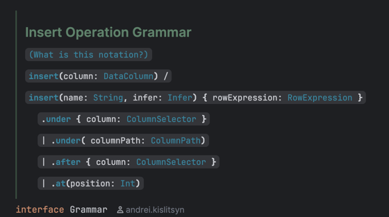
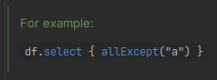
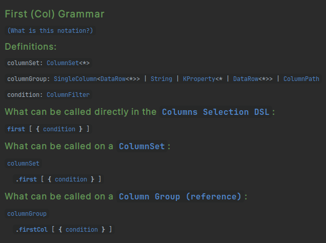
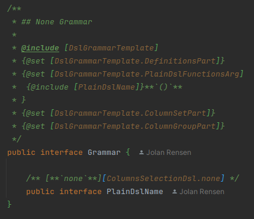
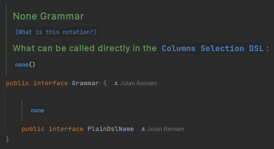
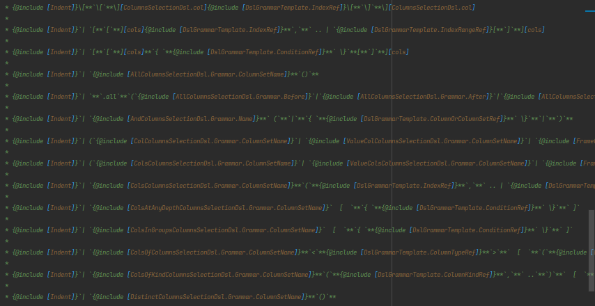
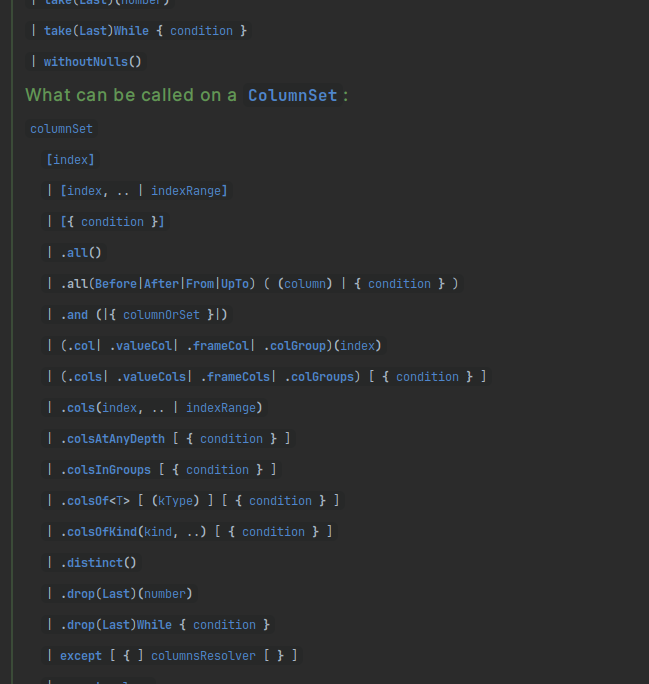

# KDocs Guidelines

This document outlines the guidelines for writing KDocs in the Kotlin DataFrame project.

<!-- TOC -->
* [KDocs Guidelines](#kdocs-guidelines)
  * [The most important advice](#the-most-important-advice)
  * [What should be documented?](#what-should-be-documented)
  * [KoDEx & KDoc-helpers](#kodex--kdoc-helpers)
    * [Compiling KDocs](#compiling-kdocs)
    * [KDoc-snippets: Reuse Common Parts](#kdoc-snippets-reuse-common-parts)
    * [KDoc-topics: Reference to Topics](#kdoc-topics-reference-to-topics)
    * [Common KDoc-helpers](#common-kdoc-helpers)
      * [URLs](#urls)
      * [Utils](#utils)
  * [Kotlin DataFrame Operations KDoc Structure](#kotlin-dataframe-operations-kdoc-structure)
    * [General Template](#general-template)
      * [First line](#first-line)
      * [Body](#body)
      * [See also section](#see-also-section)
      * [Documentation website link](#documentation-website-link-)
      * [Columns selection information](#columns-selection-information)
      * [Examples section](#examples-section)
      * [Parameters and return section](#parameters-and-return-section)
  * [KDoc-helpers Structure](#kdoc-helpers-structure)
    * [Grammar](#grammar)
      * [Symbols](#symbols)
    * [`@set`/`@get` references](#setget-references)
  * [Advanced KDocs](#advanced-kdocs)
    * [Clickable Examples](#clickable-examples)
    * [Advanced DSL Grammar Templating (Columns Selection DSL)](#advanced-dsl-grammar-templating-columns-selection-dsl)
<!-- TOC -->

## The most important advice

Please never write KDocs from scratch without a necessity!
Find existing KDocs for the similar operation or other entity and reuse it.
However, take its specifics into account.

And don't be afraid to deviate from the rules or add something new –
the most important thing is to help users to understand the library better!

## What should be documented?

**All public APIs should be documented!** Our goal is 100% public functions, classes, and variable KDocs coverage.
Some parts of public API are not intended for end users but can be used in Compiler Plugin or potential
KDF extension libraries. These methods should have a small KDoc as well.

Deprecated methods, properties, classes, and constructors are not required to have KDocs.

For the internal API, please add at least a small note.

## KoDEx & KDoc-helpers

We use [KoDEx](https://github.com/Jolanrensen/KoDEx), a KDocs preprocessor.
It adds several useful utilities for writing KDocs. 

Please read about 
the [KDocs preprocessing using KoDEx](KODEX_KDOC_PREPROCESSING.md) before working with Kotlin DataFrame KDocs.

Install the [KoDEx plugin for IDEA](https://plugins.jetbrains.com/plugin/27473---kodex---kotlin-documentation-extensions)
for a preview of the rendered KDocs inside IntelliJ IDEA.

> Note that this preview may deviate from the actual Gradle results.

### Compiling KDocs

KoDEx KDocs can be compiled using the dedicated Gradle task `processKDocsMain`:
```
Gradle > Tasks > kdocs > processKDocsMain
```

After building the sources, the resulting artifact will contain standard KDocs 
with all KoDEx utilities properly compiled and resolved.

### KDoc-snippets: Reuse Common Parts

One of the best utilities of KoDEx is the ability to reuse common parts of KDocs.
This can be done by using the 
[`@include` tag](https://github.com/Jolanrensen/KoDEx/wiki/Notation#include-including-content-from-other-kdocs),
which allows you to include a KDoc for another documentable element.
This could be a class, an interface, a typealias, and so on.

There are a lot of empty interfaces and `Nothing` typealiases in the project
that are only used by having their KDocs included in other KDocs.
They are called *KDoc-snippets*; they are marked with `@ExcludeFromSources` 
and not included in the sources after the compilation (make sure you are not referencing them directly,
i.e., only use it inside the `@include` or other KoDEx tags). 

```kotlin
/**
 * (Snippet that will be included in other KDocs)
 */
@ExcludeFromSources
internal typealias ~SnippetDescription~Snippet = Nothing

/**
 * (KDoc part;)
 * 
 * (Include snippet; it will be completely pasted here)
 * @include [~SnippetDescription~Snippet]
 * 
 * (KDoc part;)
 */
public fun someFunction()
```

For example, the
[`ColumnPathCreationSnippet` typealias](./core/src/main/kotlin/org/jetbrains/kotlinx/dataframe/documentation/snippets.kt)
has a KDoc which describes column path creation behavior. 
The whole file is excluded from sources,
but the KDoc is included in other KDocs.

Also, you can use 
[`@set` and `@get` tags](https://github.com/Jolanrensen/KoDEx/wiki/Notation#set-and-get---setting-and-getting-variables)
along with `@include` to change variable values in common parts. This is especially useful for 
writing examples of methods with similar usage but with different names.

More about `@set` and `@get` connventions [here](#setget-references).

```kotlin
/**
 * (Snippet body)
 * 
 * ### Example
 * `df.`{@get [OPERATION]}` { name and age }`
 */
@ExcludeFromSources
internal interface ~SnippetDescription~Snippet {
    /*
     * The key for a @set that will define the operation name for the snippet example.
     */
    @ExcludeFromSources
    typealias OPERATION = Nothing
}

/**
 * (KDoc part;)
 * 
 * (Include snippet; set `[select]` reference as an `OPERATION` value)
 * {@include [~SnippetDescription~Snippet] {@set [~SnippetDescription~Snippet.OPERATION] [select][select]}}
 * 
 * (KDoc part;)
 */
public fun someFunction()
```

Naming convention for KDoc-snippet — the name must fully reflect its content;
For a text snippet, also add `Snippet` at the end of its name.
For utility snippets, like `Indent` or `LineBreak`, it is not necessary.

### KDoc-topics: Reference to Topics

In addition to KDoc snippets, there are also *KDoc-topics* interfaces and typealiases.
Their KDocs are not included in other KDocs. 
Instead, they act as reference anchors, 
allowing their KDocs to be referenced as standalone topics from other KDocs.
They are not marked with `@ExcludeFromSources` and included in the sources.

For convenience, there are *link snippets* for each KDoc-topic, 
which contain a link to it, and then can be added to other KDoc it via `@include`.

```kotlin
/**
 * ## (Topic name)
 * 
 * (Topic body)
 */
internal typealias ~TopicName~ = Nothing

/** [Topic name][~TopicName~] */
@ExcludeFromSources
internal typealias ~TopicName~Link = Nothing

/**
 * (KDoc part;)
 * 
 * (Include link snippet;)
 * For more information, see {@include [~TopicName~Link]}.
 * 
 * (KDoc part;)
 */
public fun someFunction()
```

Naming convention for KDoc-topic — the name must fully reflect its content at the end.
In the future, we want to have a nice topic names with backtics 
(like `` `Access API` `` instead of `AccessApis`), but 
[it's not possible yet due to KoDEx bug](https://github.com/Jolanrensen/KoDEx/issues/97).

> Both KDoc-snippets and KDoc-topics are called *KDoc-helpers*.

All KDoc-helpers must be `internal` or `private`!

Some of KDoc-helpers can be used both as -snippets and -topics.

### Common KDoc-helpers

Some KDoc-snippets and KDoc-topics are used in multiple places in the library.
It's often useful to define them in one place and include them in multiple other places or
to just link to them.

Common KDoc-helpers in
the [documentation folder](./core/src/main/kotlin/org/jetbrains/kotlinx/dataframe/documentation)
and include things like:

- [Access APIs](./core/src/main/kotlin/org/jetbrains/kotlinx/dataframe/documentation/AccessApis.kt) 
  topics and snippets about String Names and Extension Properties API. 
  To be linked and included in KDocs of methods that use column accessing.
- [Selecting Columns](./core/src/main/kotlin/org/jetbrains/kotlinx/dataframe/documentation/SelectingColumns.kt)
  topics and snippets about different columns selection options.
  To be linked and included in KDocs of methods with columns selection.
- [Selecting Rows](./core/src/main/kotlin/org/jetbrains/kotlinx/dataframe/documentation/SelectingRows.kt)
  snippets about rows selection for operations with row selection or filtering (like `filter`).
- [`ExpressionsGivenColumn`](core/src/main/kotlin/org/jetbrains/kotlinx/dataframe/documentation/ExpressionsGivenColumn.kt) / [`-DataFrame`](core/src/main/kotlin/org/jetbrains/kotlinx/dataframe/documentation/ExpressionsGivenDataFrame.kt) / [`-Row`](core/src/main/kotlin/org/jetbrains/kotlinx/dataframe/documentation/ExpressionsGivenRow.kt) / [`-RowAndColumn`](core/src/main/kotlin/org/jetbrains/kotlinx/dataframe/documentation/ExpressionsGivenRowAndColumn.kt)
  topics and snippets to be included or linked to in functions like `perRowCol`, `asFrame`, etc.
  Explains the concepts of `ColumnExpression`, `DataFrameExpression`, `RowExpression`, etc.
- [`NA`](./core/src/main/kotlin/org/jetbrains/kotlinx/dataframe/documentation/NA.kt) / [`NaN`](./core/src/main/kotlin/org/jetbrains/kotlinx/dataframe/documentation/NaN.kt)
   topics to be linked to for more information on the concepts
- [DslGrammar](./core/src/main/kotlin/org/jetbrains/kotlinx/dataframe/documentation/DslGrammar.kt)
   topic to be linked to from each DSL grammar by the link typealias
- [various snippets and topics](./core/src/main/kotlin/org/jetbrains/kotlinx/dataframe/documentation/snippets.kt)
  with common mechanisms description.
- And many others; Check the folder to see if there are more and feel free to add them if needed :)

#### URLs

When linking to external URLs, it's recommended to use
[DocumentationUrls](./core/src/main/kotlin/org/jetbrains/kotlinx/dataframe/documentation/DocumentationUrls.kt) and
[Issues](./core/src/main/kotlin/org/jetbrains/kotlinx/dataframe/documentation/Issues.kt).

It's a central place where we can store URLs that can be used in multiple places in the library. Plus, it makes
it easier to update the documentation whenever (a part of) a URL changes.

For [Kotlin DataFrame GitHub issues and PRs](https://github.com/Kotlin/dataframe/issues),
you can just write its number like `#1234` in the KDoc.

#### Utils

The [`utils.kt` file](./core/src/main/kotlin/org/jetbrains/kotlinx/dataframe/documentation/utils.kt) contains all sorts of KDoc-helpers for the documentation.
For instance `{@include [LineBreak]}` can insert a line break in the KDoc and the family of `Indent`
documentation snippets can provide you with different non-breaking-space-based indents.

If you need a new utility, feel free to add it to this file.

## Kotlin DataFrame Operations KDoc Structure

Operation KDocs size and structure completely depend on the operation's complexity. 

The best way to write a new KDoc for an operation is to define its kind and 
use the existing KDoc of an operation of the same kind as a template.

There are four kinds:

1. Simple, Stdlib-like operations that don't have arguments or have simple types (primitives, classes) 
as arguments and return simple value, `DataFrame`, `DataRow` or `DataColumn`.
   * For example, 
[`first` without arguments](./core/src/main/kotlin/org/jetbrains/kotlinx/dataframe/api/first.kt).
   * KDocs for such operations can be short, especially if it's trivial enough.
2. Operations with [`DataRow` API](https://kotlin.github.io/dataframe/datarow.html). 
   * For example, [`first` with predicate](./core/src/main/kotlin/org/jetbrains/kotlinx/dataframe/api/first.kt).
   * Remember to describe the mechanism of `DataRow` API usage in the KDoc - it's not obvious to the user.
3. Operations with the [Columns Selection DSL](https://kotlin.github.io/dataframe/columnselectors.html) that return a single and simple value, `DataFrame`, `DataRow` or `DataColumn`.
   * For example, [`remove`](./core/src/main/kotlin/org/jetbrains/kotlinx/dataframe/api/remove.kt).
   * Remember to describe the mechanism of Columns Selection DSL. 
   * Add several examples with different columns selection options.
4. Complex operations with a multiple-methods chain.
   * For example, [`convert`](./core/src/main/kotlin/org/jetbrains/kotlinx/dataframe/api/convert.kt).
   * Such operations consist of at least two methods and special resulting classes as the intermediate steps. 
     All of them should be well-documented and have cross-references to each other.
   * Usually, complex operation methods have the 
     [Columns Selection DSL](https://kotlin.github.io/dataframe/columnselectors.html); 
     these methods should be documented by the rules above.
   * For a better understanding of the complex operation, we write an [operation grammar](#grammar) using a 
   [special notation](./core/src/main/kotlin/org/jetbrains/kotlinx/dataframe/documentation/DslGrammar.kt).
   Add a reference to the operation Grammar in each related class and method KDoc.

### General Template
    
The generalized template for all operations:

```kotlin
/**
 * (First line - brief and concise description of the operation)
 * 
 * (Body - second, third, and so on lines - detailed description of the operation,
 * related mechanisms, etc.; optional)
 * 
 * (Documentation website link)
 * 
 * (See also section; optional)
 * 
 * (Columns selection information - for operations with columns selection only)
 * 
 * (Examples section)
 * 
 * (Parameters and return section)
 */
```

Below there are some rules for each section:

#### First line

The first line should be short but at the same time give a clear understanding of the operation.

Should start with a verb. Usually "returns" or "creates" for operations that return a simple value, 
`DataFrame`, `DataColumn` or `DataRow` (excluding methods which are non-final part of complex operations).

#### Body

For non-trivial operations, write a detailed description of the operation, 
describe method behavior and the resulting value.

Describe method-specific mechanisms, especially if it has a non-trivial lambda as an argument. 
For example, for methods with the `RowFilter` predicate, add

```kotlin
{@include [SelectingRows.RowFilterSnippet]}
```

For complex operations, in the KDoc of the initial method write that this is only the first step of the operation,
and it should be continued with other methods. Also add a note about the [operation grammar](#grammar) in this case.
For example (from the `insert` KDoc):

```
 * This function does not immediately insert the new column but instead specify a column to insert and
 * returns an [InsertClause],
 * which serves as an intermediate step.
 * The [InsertClause] object provides methods to insert a new column using:
 * - [under][InsertClause.under] - inserts a new column under the specified column group.
 * - [after][InsertClause.after] - inserts a new column after the specified column.
 * - [at][InsertClause.at]- inserts a new column at the specified position.
 *
 * Each method returns a new [DataFrame] with the inserted column.
 * 
 * Check out [Grammar].
```

The next methods in the chain may be finalizing or intermediate steps - write about it explicitly.
Remember to add a link to the initial method and [operation grammar](#grammar) in all of them.

If the method uses column(s) selection, add a note about nested columns and column groups:

```
@include [SelectingColumns.ColumnGroupsAndNestedColumnsMention]
```

and add a link to the 
[Selecting Columns topic](./core/src/main/kotlin/org/jetbrains/kotlinx/dataframe/documentation/SelectingColumns.kt)
usually with the customized examples, see [below](#kdoc-helpers-structure).

```
See [Selecting Columns][InsertSelectingOptions].
```

#### See also section

Add a reference to all related methods. Those can be methods with the similar or opposite behavior.

Example from `DataFrame.first` KDoc:

```
 * See also [firstOrNull][DataFrame.firstOrNull],
 * [last][DataFrame.last],
 * [take][DataFrame.take],
 * [takeWhile][DataFrame.takeWhile],
 * [takeLast][DataFrame.takeLast].
```

* If there is a reverse operation, add a specific note about it.
* If this operation is a shortcut or a special case of another one,
add a note about it. 
* If you think a user can confuse the operation with another one,
write it down exactly like that.

For example, from `group` KDoc:


```
 * Reverse operation: [ungroup].
 *
 * It is a special case of [move] operation.
 *
 * Don't confuse this with [groupBy],
 * which groups the dataframe by the values in the selected columns!
```

#### Documentation website link 

Add a link to the corresponding operation in the 
[documentation website](https://kotlin.github.io/dataframe).

Please add it as a KDoc-snippet inside 
[DocumentationUrls](./core/src/main/kotlin/org/jetbrains/kotlinx/dataframe/documentation/DocumentationUrls.kt)
and then use add it using `@include`:

```
 * For more information: {@include [DocumentationUrls.Move]}
```

#### Columns selection information

For any method with columns selection, add a section with information about the columns selection.

Usually, just `@include` 
[custom `SelectingColumns` snippet](./core/src/main/kotlin/org/jetbrains/kotlinx/dataframe/documentation/SelectingColumns.kt).

#### Examples section

Write meaningful, easy-to-understand examples, with detailed comments.

For complex operations, write a **complete** example with all steps.

For methods with Columns Selection DSL, add several examples with different CS DSL selection methods.

Start the section with

```
### Examples
```

#### Parameters and return section

Describe parameters and return of the method using `@param` and `@return` tags. 
Remember type parameters.

Wrap parameter names into `[]` for better readability.

## KDoc-helpers Structure

Sometimes, you do not need KDoc-helpers at all —
for simple operations, it's enough to write a short KDoc.

However, if you want to reuse some common parts of KDocs 
(for example, for different overloads of the same method or very similar methods),
it's better to use some KDoc-helpers.

Here's a standard structure for operation KDoc-helpers:

```kotlin
// Main KDoc helper interface

/**
 * (First line)
 * 
 * (Body)
 * 
 * (Documentation website link)
 * 
 * (See also section)
 */
internal interface ~OperationName~Docs {

    // `SelectingColumns` helper KDoc with this operation in examples
    // - for operations with columns selection
    /**
     * @comment Version of [SelectingColumns] with correctly filled in examples
     * @include [SelectingColumns] {@include [Set~OperationName~OperationArg]}
     */
    typealias ~OperationName~Options = Nothing

    // Operation Grammar - for the initial method of the complex operations
    /**
     * ## ~OperationName~ Operation Grammar
     * {@include [LineBreak]}
     * {@include [DslGrammarLink]}
     * {@include [LineBreak]}
     * ...
     */
    typealias Grammar = Nothing
}

// Set operation in [SelectingColumns] examples (in [SelectingColumns.Dsl] and so on)
/** @set [SelectingColumns.OPERATION] [~operationName~][~operation~] */
@ExcludeFromSources
private typealias Set~OperationName~OperationArg = Nothing

// Common KDoc part for different overloads of the same method
/**
 * @include [~OperationName~Docs]
 * ### This ~OperationName~ Overload
 */
@ExcludeFromSources
private typealias Common~OperationName~Docs = Nothing

/**
 * (Include common docs)
 * @include [Common~OperationName~Docs]
 * 
 * (Columns selection information)
 * @include [SelectingColumns.Dsl] {@include [Set~OperationName~OperationArg]}
 * 
 * (Examples section)
 * 
 * (Parameters and return section)
 */
public fun <T, C> DataFrame<T>.operation(columns: ColumnsSelector<T, C>)
```

### Grammar

DSL Grammar (helpers usually are called simply `Grammar` and place inside the
helper interface) is a special notation for describing 
the complex operation.



Any family of functions or operations can show off their notation in a DSL grammar.
This is done by creating a KDoc-topic like
[`InsertDocs.Grammar`](./core/src/main/kotlin/org/jetbrains/kotlinx/dataframe/api/insert.kt) and linking to it
from each function.

Each grammar doc must come with a `{@include [DslGrammarLink]}`, which is a link to provide the user with the details
of how the [DSL grammar notation](./core/src/main/kotlin/org/jetbrains/kotlinx/dataframe/documentation/DslGrammar.kt)
works.
An explanation is provided for each symbol used in the grammar.

I'll copy it here for reference:

The notation we use is _roughly_ based on [EBNF](https://en.wikipedia.org/wiki/Extended_Backus%E2%80%93Naur_form)
with some slight deviations to improve readability in the context of Kotlin.
The grammars are also almost always decorated with highlighted code snippets allowing you to click around and explore!

#### Symbols

- '**`bold text`**' : literal Kotlin notation, e.g. '**`myFunction`**', '**`{ }`**', '**`[ ]`**', etc.
- '`normal text`' : Definitions or types existing either just in the grammar or in the library itself.
- '`:`' : Separates a definition from its type, e.g. '`name: String`'.
- '`|`', '`/`' : Separates multiple possibilities, often clarified with `()` brackets or spaces, e.g. '**`a`**` ( `**`b`
  **` | `**`c`**` )`'.
- '`[ ... ]`' : Indicates that the contents are optional, e.g. '`[ `**`a`**` ]`'. Careful to not confuse this with *
  *bold** Kotlin brackets **`[]`**.
    - NOTE: sometimes **`function`**` [`**`{ }`**`]` notation is used to indicate that the function has an optional
      lambda. This function will still require **`()`** brackets to work without lambda.
- '**`,`**` ..`' : Indicates that the contents can be repeated with multiple arguments of the same type(s), e.g. '`[ `*
  *`a,`**` .. ]`'.
- '`( ... )`' : Indicates grouping, e.g. '`( `**`a`**` | `**`b`**` )` **`c`**'.

No other symbols of [EBNF](https://en.wikipedia.org/wiki/Extended_Backus%E2%80%93Naur_form) are used.

Note that the grammar is not always 100% accurate to keep the readability acceptable.
Always use your common sense reading it, and if you're unsure, try out the function yourself or check
the source code :).


### `@set`/`@get` references

Sometimes, when you create a template KDoc for different operations,
it's highly useful to have one or more KDoc variables.

```kt
/**
 * Hello from {@get [OPERATION]}!
 */
internal interface CommonDoc {
    
    // Use UPPER_CASE for references to the set/get arguments
    @ExcludeFromSources
    typealias OPERATION = Nothing
}
```

When using `@set` and `@get` / `$`, it's a good practice to use a reference as the key name.
This makes the KDoc more refactor-safe, and it makes it easier to understand which arguments
need to be provided for a certain template.

A good example of this concept can be found in the
[`AllColumnsSelectionDsl.CommonAllSubsetDocs` documentation interface](./core/src/main/kotlin/org/jetbrains/kotlinx/dataframe/api/all.kt).
This interface provides a template for all overloads of `allBefore`,
`allAfter`, `allFrom`, and `allUpTo` in a single place.

Nested in the documentation interface, there are several other KDoc-helpers that define the expected arguments
of the template.
These KDoc-helpes are named `TITLE`, `FUNCTION`, etc. and commonly have no KDocs itself,
just a simple comment explaining what the argument is for.

Other KDoc-helpers like `AllAfterDocs` or functions then include `CommonAllSubsetDocs` and set
all the arguments accordingly.

It's recommended to name write their name in `UPPER_CASE`
and have them nested in the documentation interface.

## Advanced KDocs

### Clickable Examples

Examples inside ` ```kt ``` ` code blocks are not clickable unfortunately, as they are not resolved
as actual code
([KT-55073](https://youtrack.jetbrains.com/issue/KT-55073/Improve-KDoc-experience),
[KTIJ-23232](https://youtrack.jetbrains.com/issue/KTIJ-23232/KDoc-autocompletion-and-basic-highlighting-of-code-samples)).

To work around this, we can do it manually by adding `` ` `` tags and references to functions.
For instance, writing

```kt 
/**
 * For example:
 *
 * `df.`[`select`][DataFrame.select]`  {  `[`allExcept`][ColumnsSelectionDsl.allExcept]`("a") }`
 */
```

will render it correctly, like:



But keep these things in mind:

- `[]` references don't work inside `` ` `` tags, so make sure you write them outside code scope.
- Make sure all empty spaces are inside `` ` `` code spans. If they aren't, they will render weirdly.
- According to the [spec](https://github.github.com/gfm/#code-spans), if a string inside a `` ` `` code span `` ` ``
  begins and ends with a space but does not consist entirely of whitespace, a single space is removed from the front
  and the back. So be careful writing things like `` ` { ` `` and add extra spaces if needed.
- In IntelliJ, references inside `[]` are automatically formatted as `<code>` when rendered to HTML at the moment.
  This may change in the future,
  so if you want to be sure it looks like code, you can write it like: `` [`function`][ref.to.function]  ``
- Having multiple `[]` references and code spans in the same line breaks rendering in
  IntelliJ ([KT-55073](https://youtrack.jetbrains.com/issue/KT-55073/Improve-KDoc-experience#focus=Comments-27-6854785.0-0)).
  This can be avoided by providing aliases to each reference.
- Both `**` and `__` can be used to make something __bold__ in Markdown. So if you ever need to `@include` something
  bold next to something else bold and you want to avoid getting `**a****b**` (which doesn't render correctly),
  alternate,
  like `**a**__b__`.
- Add one extra newline if you want to put something on a new line. Otherwise, they'll render on the same line.
- Use `&nbsp;` (or `{@include [Indent]}`) to add non-breaking-space-based indents in you code samples.


### Advanced DSL Grammar Templating (Columns Selection DSL)

One place where KoDEx really shines is in the templating of DSL grammars.
This has been executed for providing DSL grammars to each function family of the Columns Selection DSL
(and a single large grammar for the DSL itself and the website).
It could be repeated in other places if it makes sense there.
I'll provide a brief overview of how this is structured for this specific case.

The template is defined
at [DslGrammarTemplateColumnsSelectionDsl.DslGrammarTemplate](./core/src/main/kotlin/org/jetbrains/kotlinx/dataframe/documentation/DslGrammarTemplateColumnsSelectionDsl.kt).

Filled in, it looks something like:



As you can see, it consists of three parts: `Definitions`, `What can be called directly in the Columns Selection DSL`,
`What can be called on a ColumnSet`, and `What can be called on a Column Group (reference)`.

The definition part is filled in like:

```kt 
/**
 * {@set [DslGrammarTemplate.DEFINITIONS]
 *  {@include [DslGrammarTemplate.ColumnSetDef]}
 *  {@include [LineBreak]}
 *  {@include [DslGrammarTemplate.ColumnGroupDef]}
 *  {@include [LineBreak]}
 *  {@include [DslGrammarTemplate.ConditionDef]}
 *  ...
 * }
 */
```

Inside, it should contain all definitions used in the current grammar.
All definitions are defined at `DslGrammarTemplate.XDef` and they contain their formal name and type.
They need to be broken up by line breaks.

All other parts are filled in like:

```kt
/**
 * {@set [DslGrammarTemplate.PLAIN_DSL_FUNCTIONS]
 *  {@include [PlainDslName]}`  [  `**`{ `**{@include [DslGrammarTemplate.ConditionRef]}**` \}`**` ]`
 *  ...
 * }
 *
 * {@set [DslGrammarTemplate.COLUMN_SET_FUNCTIONS]
 *  {@include [Indent]}{@include [ColumnSetName]}`  [  `**`{ `**{@include [DslGrammarTemplate.ConditionRef]}**` \}`**` ]`
 *  ...
 * }
 * ...
 */
interface Grammar {

    /** [**`first`**][ColumnsSelectionDsl.first] */
    typealias PlainDslName = Nothing

    /** __`.`__[**`first`**][ColumnsSelectionDsl.first] */
    typealias ColumnSetName = Nothing

    /** __`.`__[**`firstCol`**][ColumnsSelectionDsl.firstCol] */
    typealias ColumnGroupName = Nothing
}
```

When a reference to a certain definition is used, we take `DslGrammarTemplate.XRef`.
Clicking on them takes users to the respective
`XDef` and thus provides them with the formal name and type of the definition.

You may also notice that the `PlainDslName`, `ColumnSetName`, and `ColumnGroupName` 
KDoc-helpers are defined separately.
This is to make sure they can be reused in the large Columns Selection DSL grammar and on the website.

You don't always need all three parts in the grammar; not all functions can be used in each context.
For instance, for the function `none()`, the column set- and column group parts can be dropped.
This can be done in this template by overwriting the respective `DslGrammarTemplate.XPart` with nothing, like here:

<p align="center">
  
&nbsp; &nbsp; &nbsp; &nbsp;
  
</p>

Finally, to wrap up the part about this specific template, I'd like to show you the end result.
This is a part of the grammar for the `ColumnsSelectionDsl` itself and how it renders in the KDoc on the user side:

<p align="center">
  
&nbsp; &nbsp; &nbsp; &nbsp;
  
</p>

A fully interactive, single-source-of-truth grammar for the Columns Selection DSL!


