# KDoc Preprocessing with KoDEx

You might have spotted some notations like `{@include [Something]}` in the `/** KDocs */` of DataFrame's source code.
These are special notations for [KoDEx](https://github.com/Jolanrensen/KoDEx)
that we use to generate parts of the KDoc documentation.

Kotlin libraries like DataFrame use KDoc to document their code and especially their public API. This allows users
to understand how to use the library and what to expect from it. However, writing KDoc can be a tedious task, especially
when you have to repeat the same information in multiple places. KoDEx allows us to write the
information only once and then include it in multiple places.

This document explains how to use KoDEx in the DataFrame project.

<!-- TOC -->

* [KDoc Preprocessing](#kdoc-preprocessing-with-kodex)
    * [How the Processing Works](#how-the-processing-works)
    * [Previewing the Processed KDocs in IntelliJ IDEA](#previewing-the-processed-kdocs-in-intellij-idea)
    * [Notation](#notation)
        * [`@include`: Including content from other KDocs](#include-including-content-from-other-kdocs)
        * [
          `@includeFile`: Including all content from a relative file](#includefile-including-all-content-from-a-relative-file)
        * [`@set` and `@get` / `$`: Setting and getting variables](#set-and-get---setting-and-getting-variables)
        * [`@comment`: Commenting out KDoc content](#comment-commenting-out-kdoc-content)
        * [`@sample` and
          `@sampleNoComments`: Including code samples](#sample-and-samplenocomments-including-code-samples)
        * [`@exportAsHtmlStart` and
          `@exportAsHtmlEnd`: Exporting content as HTML](#exportashtmlstart-and-exportashtmlend-exporting-content-as-html)
        * [`\`: Escape Character](#-escape-character)
        * [
          `@ExcludeFromSources` Annotation: Excluding code content from sources](#excludefromsources-annotation-excluding-code-content-from-sources)
    * [KoDEx Conventions in DataFrame](#kodex-conventions-in-dataframe)
        * [Common Concepts and Definitions](#common-concepts-and-definitions)
        * [Link Interfaces](#link-interfaces)
        * [Arg Interfaces](#arg-interfaces)
        * [URLs](#urls)
        * [Utils](#utils)
        * [Documenting an Operation](#documenting-an-operation)
        * [Clickable Examples](#clickable-examples)
        * [DSL Grammars](#dsl-grammars)
            * [Symbols](#symbols)
    * [Advanced DSL Grammar Templating (Columns Selection DSL)](#advanced-dsl-grammar-templating-columns-selection-dsl)
    * [KDoc -> WriterSide](#kdoc---writerside)

<!-- TOC -->

## How the Processing Works

Unlike Java, Kotlin library authors
[don't have the ability to share a jar file with documentation](https://github.com/Kotlin/dokka/issues/2787). They have
to share documentation along with their `sources.jar` file which users can attach in their IDE to see the docs.
DataFrame thus uses KoDEx in Gradle to copy and modify the source code, processing the KDoc notations,
and publishing the modified files as the `sources.jar` file.

This can be seen in action in the `core:processKDocsMain` and `core:changeJarTask` Gradle tasks in the
[core/build.gradle.kts file](core/build.gradle.kts). When you run any `publish` task in the `core` module, the
`processKDocsMain` task is executed first, which processes the KDocs in the source files and writes them to the
`generated-sources` folder. The `changeJarTask` task then makes sure that any `Jar` task in the `core` module uses the
`generated-sources` folder as the source directory instead of the normal `src` folder.
It's possible to optionally skip this step, for example, when you publish the library locally during development, 
by providing the `-PskipKodex` project property: `./gradlew publishToMavenLocal -PskipKodex`

`core:processKDocsMain` can also be run separately if you just want to see the result of the KDoc processing by KoDEx.

To make sure the generated sources can be seen and reviewed on GitHub,
since [PR #731](https://github.com/Kotlin/dataframe/pull/731),
there's been a [GitHub action](.github/workflows/generated-sources.yml) that runs the `core:processKDocsMain` task and
shows the results in the PR checks. After a PR is
merged, [another action](.github/workflows/generated-sources-master.yml)
runs on the master branch and commits the generated sources automatically.
This way, the generated sources are always up to date with the latest changes in the code.
This means you don't have to run and commit the generated sources yourself, though it's
still okay if you do.

The processing by KoDEx is done in multiple "waves" across the source files.
Each "wave" processes different notations and depends on the results of previous waves.
DataFrame uses
the [recommended order](https://github.com/Jolanrensen/KoDEx/tree/main?tab=readme-ov-file#recommended-order-of-default-processors)
of processors, which is as follows:

- `INCLUDE_DOC_PROCESSOR`: The `@include` processor
- `INCLUDE_FILE_DOC_PROCESSOR`: The `@includeFile` processor
- `ARG_DOC_PROCESSOR`: The `@set` and `@get` / `$` processor. This runs `@set` first and then `@get` / `$`.
- `COMMENT_DOC_PROCESSOR`: The `@comment` processor
- `SAMPLE_DOC_PROCESSOR`: The `@sample` and `@sampleNoComments` processor
- `EXPORT_AS_HTML_DOC_PROCESSOR`: The `@exportAsHtmlStart` and `@exportAsHtmlEnd` tags for `@ExportAsHtml`
- `REMOVE_ESCAPE_CHARS_PROCESSOR`: The processor that removes escape characters

See the [Notation](#notation) section for more information on each of these processors.

## Previewing the Processed KDocs in IntelliJ IDEA

KoDEx comes with an
[IntelliJ IDEA plugin](https://plugins.jetbrains.com/plugin/26250)
that allows you to preview the processed KDocs without having to run the Gradle task.
It also provides highlighting for the KDoc notations and more.


As described in the README of KoDEx, the plugin may not 100% match the results of the Gradle task. This is
because it uses IntelliJ to resolve references instead of Dokka. However, it should give you a good idea of what the
processed KDocs will look like, and, most importantly, it's really fast.

You can install the plugin from [the marketplace](https://plugins.jetbrains.com/plugin/26250),
by building the project yourself, 
or by downloading the latest release from the
[releases page](https://github.com/Jolanrensen/KoDEx/releases).
Simply look for the latest release which has the zip file attached.
If it's outdated or doesn't work on your version of IntelliJ, don't hesitate to
ping [@Jolanrensen](https://github.com/Jolanrensen)
on GitHub. This also applies if you have any issues with the IntelliJ or Gradle plugin, of course :).

## Notation

KoDEx uses special notations in KDocs to indicate that a certain (tag) processor should be applied
in that place.
These notations follow the Javadoc/KDoc `@tag content`/`{@tag content}` tag conventions.

Tags without `{}` are allowed, but only at the beginning of a line, like you're used to with
`@param`, `@return`, `@throws`, etc. If you want to use them in the middle of a line, or inside ` ``` ` blocks,
you should use `{}`.

Tag processors have access to any number of arguments they need, which are separated by spaces, like:

```kt
/**
 * @tag arg1 arg2 arg3 extra text
 * or {@tag arg1 arg2 arg3}
 */
```

though, most only need one or two arguments.
It's up to the tag processor what to do with excessive arguments, but most tag processors will leave them in place.

### `@include`: Including content from other KDocs

<p align="center">
  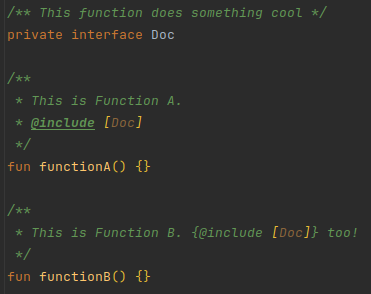
&nbsp; &nbsp; &nbsp; &nbsp;
  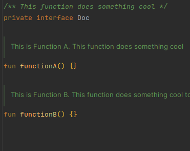
</p>

The most used tag across the library is `@include [Reference]`.
This tag includes all the content of the supplied reference's KDoc in the current KDoc.
The reference can be a class, function, property, or any other documented referable entity.
The reference can be a fully qualified name or a relative name; imports and aliases are taken into account.

You cannot include something from another library at the moment.

Writing something after the include tag, like

```kt
/**
 * @include [Reference] some text
 */
```

is allowed and will remain in place. Like:

```kt
/**
 * This is from the reference. some text
 */
```

Referring to a function with the same name as the current element is allowed and will be resolved correctly
(although, the IntelliJ plugin will not resolve it correctly).
KoDEx assumes you don't want a circular reference, as that does not work for obvious reasons.

Finally, if you include some KDoc that contains a `[reference]`, KoDEx will replace that reference
with its fully qualified path. This is important because we cannot assume that the target file has access to
the same imports as the source file. The original name will be left in place as alias, like
`[reference][path.to.reference]`.
This is also done for references used as key in `@set` and `@get` / `$` tags.

### `@includeFile`: Including all content from a relative file

This tag is not used in the DataFrame project at the moment. It's used like:

```kt
/**
 * @includeFile (path/to/file.kt)
 */
```

and, as expected, it pastes the content of the file at the location of the tag.

Both the relative- and absolute paths are supported.

### `@set` and `@get` / `$`: Setting and getting variables

<p align="center">
  
&nbsp; &nbsp; &nbsp; &nbsp;
  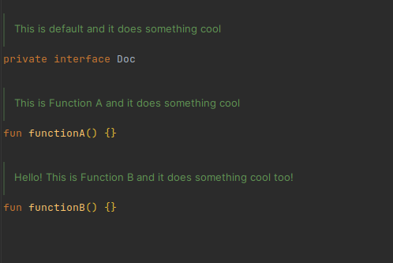
</p>

Combined with `@include`, these tags are the most powerful ones available.
They allow you to create templates and fill them in with different values at the location they're included.

`@set` is used to set a variable, and `@get` / `$` is used to get the value of a variable
(with an optional default value).

What's important to note is that this processor is run **after** the `@include` processor and the variables
that are created with `@set` are only available in the current KDoc.

To form an idea of how they are processed, it's best to think of waves of processing again.

All `@set` tags are processed before any `@get` / `$` tags.
So there's no `{@set A {@get B}}` cycle, as that would not work.

For example, given the KDoc from the picture above:

```kt
/**
 * @include [Doc]
 * @set NAME Function A
 */
```

After running the `@include` processor, the intermediate state of the KDoc will be:

```kt
/**
 * This is {@get NAME default} and it does something cool
 * @set NAME Function A
 */
```

Then, all `@set` statements are processed:

```kt
/**
 * This is {@get NAME default} and it does something cool
 */
```

`NAME` is `"Function A"` now.

Then all `@get` statements are processed:

```kt
/**
 * This is Function A and it does something cool
 */
```

You can put as many `@set` and `@get` / `$` tags in a KDoc as you want, just make sure to pick unique
key names :).
I'd always recommend using a `[Reference]` as key name.
It's a good practice to keep the key names unique and refactor-safe.

Finally, you need to make sure you take the order of tags processing into account. As stated by
the [README](https://github.com/Jolanrensen/KoDEx/tree/main?tab=readme-ov-file#preprocessors),
tags are processed in the following order:

* Inline tags
    * depth-first
    * top-to-bottom
    * left-to-right
* Block tags
    * top-to-bottom

This means that you can overwrite a variable by a block tag that was set by an inline tag even if the
inline tag is written below the block tag!

For example:

```kt
/**
 * $NAME
 * @set NAME a
 * {@set NAME b}
 */
```

Here, `NAME` is first set to `"b"` and the ` {@set NAME b}` part is erased from the doc.
Then `NAME` is set to `"a"` and that line disappears too.
`$NAME` is rewritten to `{@get NAME}` and then it's replaced by retrieving the value of `NAME`,
which makes the final doc look like:

```kt
/**
 * a
 *
 */
```

### `@comment`: Commenting out KDoc content

<p align="center">
  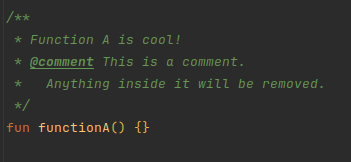
&nbsp; &nbsp; &nbsp; &nbsp;
  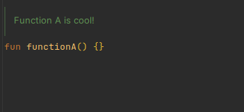
</p>

Just like being able to use `//` in code to comment out lines, you can use `@comment` to comment out KDoc content.
This is useful for documenting something about the preprocessing processes that should not be visible in the
published `sources.jar`.

Anything inside a `@comment` tag block or inline tag `{}` will be removed from the KDoc when the processor is run.

### `@sample` and `@sampleNoComments`: Including code samples

<p align="center">
  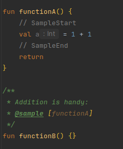
&nbsp; &nbsp; &nbsp; &nbsp;
  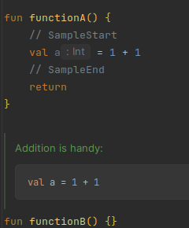
</p>

While this processor is not used in the DataFrame project at the moment, it can be seen as an extension
to the normal `@sample` tag. While the 'normal' `@sample [Reference]` tag shows the code from the target reference as
is,
`@sample` and `@sampleNoComments` actually copy over the code to inside a ` ```kt ``` ` (or `java`) code block in the
KDoc.

Just like [korro](https://github.com/devcrocod/korro), if `// SampleStart` or `// SampleEnd` are present in the code,
only the code between these markers will be included in the KDoc.

`@sampleNoComments` is the same as `@sample`, but it will remove all KDocs from the code before pasting it here.

### `@exportAsHtmlStart` and `@exportAsHtmlEnd`: Exporting content as HTML

See [KDoc -> WriterSide](#kdoc---writerside).

### `\`: Escape Character

The final wave of processing is the removal of escape characters.
This is done by the `REMOVE_ESCAPE_CHARS_PROCESSOR`.

The escape character `\` is used to escape the special characters `@`, `{`, `}`, `[`, `]`, `$`, and `\` itself.
Escaped characters are ignored by processors and are left in place.

This means that `/** {\@get TEST} */` will become `/** {@get TEST} */` after preprocessing instead of actually
fetching the value of `TEST`.
Similarly, `/** [Reference\] */` will not be replaced by the fully qualified path of `Reference` after it is
`@include`'d somewhere else.
This can come in handy when building difficult templates containing a lot of `[]` characters that should not be
treated as references.

### `@ExcludeFromSources` Annotation: Excluding code content from sources

<p align="center">
  
&nbsp; &nbsp; &nbsp; &nbsp;
  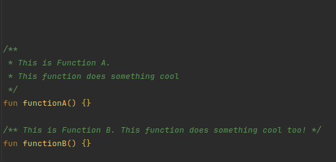
</p>

The `@ExcludeFromSources` annotation is used to exclude a class, function, or property from the `sources.jar` file.
This is useful to clean up the sources and delete interfaces or classes that are only used as KDoc 'source'.

The annotation is not a KDoc tag but a normal Kotlin annotation detected by KoDEx.

Since [v0.3.9](https://github.com/Jolanrensen/KoDEx/releases/tag/v0.3.9) it's also possible to
exclude a whole file from the `sources.jar` by adding the annotation to the top of the file,
like `@file:ExcludeFromSources`.

## KoDEx Conventions in DataFrame

### Common Concepts and Definitions

Some definitions are used in multiple places in the library.
It's often useful to define them in one place and include them in multiple other places or
to just link to them so users can read more explanation while clicking through KDocs.

Common definitions and concepts are placed in
the [documentation folder](./core/src/main/kotlin/org/jetbrains/kotlinx/dataframe/documentation)
and include things like:

- [Access APIs](./core/src/main/kotlin/org/jetbrains/kotlinx/dataframe/documentation/AccessApi.kt)
    - To be linked to
    - String API, Column Accessors API etc.
- [Selecting Columns](./core/src/main/kotlin/org/jetbrains/kotlinx/dataframe/documentation/SelectingColumns.kt)
    - To be included in `select`, `update` etc. like `{@include [SelectingColumns.ColumnNames.WithExample]}` (with
      args).
    - Or to be linked to with `{@include [SelectingColumnsLink]}`.
    - By name, by column accessor, by DSL etc.
- [Selecting Rows](./core/src/main/kotlin/org/jetbrains/kotlinx/dataframe/documentation/SelectingRows.kt)
    - To be included like `{@include [SelectingRows.RowValueCondition.WithExample]}` in `Update.where`, `filter`, etc.
    - Explains the concept and provides examples (with args)
- [`ExpressionsGivenColumn`](core/src/main/kotlin/org/jetbrains/kotlinx/dataframe/documentation/ExpressionsGivenColumn.kt) / [`-DataFrame`](core/src/main/kotlin/org/jetbrains/kotlinx/dataframe/documentation/ExpressionsGivenDataFrame.kt) / [`-Row`](core/src/main/kotlin/org/jetbrains/kotlinx/dataframe/documentation/ExpressionsGivenRow.kt) / [`-RowAndColumn`](core/src/main/kotlin/org/jetbrains/kotlinx/dataframe/documentation/ExpressionsGivenRowAndColumn.kt)
    - To be included or linked to in functions like `perRowCol`, `asFrame`, etc.
    - Explains the concepts of `ColumnExpression`, `DataFrameExpression`, `RowExpression`, etc.
- [`NA`](./core/src/main/kotlin/org/jetbrains/kotlinx/dataframe/documentation/NA.kt) / [`NaN`](./core/src/main/kotlin/org/jetbrains/kotlinx/dataframe/documentation/NaN.kt)
    - To be linked to for more information on the concepts
- [DslGrammar](./core/src/main/kotlin/org/jetbrains/kotlinx/dataframe/documentation/DslGrammar.kt)
    - To be linked to from each DSL grammar by the link interface
- Check the folder to see if there are more and feel free to add them if needed :)

### Link Interfaces

As can be seen, interfaces that can be "linked" to, like [`AccessApi`](./core/src/main/kotlin/org/jetbrains/kotlinx/dataframe/documentation/AccessApi.kt), are often
accompanied by a `-Link` interface, like

```kt
/** [Access API][AccessApi] */
internal interface AccessApiLink
```

This allows other docs to simply `{@include [AccessApiLink]}` if they want to refer to
Access APIs, and it provides a single place of truth for if we ever want to rename this concept.

In general, docs accompanied by a `-Link` interface are meant to be linked to, while docs without
a `-Link` interface are meant to be included in other docs
(and are often accompanied by [`@ExcludeFromSources`](#excludefromsources-annotation-excluding-code-content-from-sources)).
We can deviate from this convention if it makes sense, of course.

### Arg Interfaces

```kt
/**
 * ## Common Doc
 * Hello from $[NameArg]!
 */
interface CommonDoc {

    // The name to be greeted from
    interface NameArg
    
    // alternative recommended notation
    interface NAME
}
```

When using `@set` and `@get` / `$`, it's a good practice to use a reference as the key name.
This makes the KDoc more refactor-safe, and it makes it easier to understand which arguments
need to be provided for a certain template.

A good example of this concept can be found in the
[`AllColumnsSelectionDsl.CommonAllSubsetDocs` documentation interface](./core/src/main/kotlin/org/jetbrains/kotlinx/dataframe/api/all.kt).
This interface provides a template for all overloads of `allBefore`,
`allAfter`, `allFrom`, and `allUpTo` in a single place.

Nested in the documentation interface, there are several other interfaces that define the expected arguments
of the template.
These interfaces are named `TitleArg`/`TITLE`, `FunctionArg`/`FUNCTION`, etc. and commonly have no KDocs itself,
just a simple comment explaining what the argument is for.

Other documentation interfaces like `AllAfterDocs` or functions then include `CommonAllSubsetDocs` and set
all the arguments accordingly.

It's recommended to name argument interfaces `-Arg`, or to write their name in `ALL_CAPS` (if the linter is shushed) 
and have them nested in the documentation interface, though,
this has not always been done in the past.

### URLs

When linking to external URLs, it's recommended to use
[DocumentationUrls](./core/src/main/kotlin/org/jetbrains/kotlinx/dataframe/documentation/DocumentationUrls.kt) and
[Issues](./core/src/main/kotlin/org/jetbrains/kotlinx/dataframe/documentation/Issues.kt).

It's a central place where we can store URLs that can be used in multiple places in the library. Plus, it makes
it easier to update the documentation whenever (part of) a URL changes.

### Utils

The [`utils.kt` file](./core/src/main/kotlin/org/jetbrains/kotlinx/dataframe/documentation/utils.kt) contains all sorts of helper interfaces for the documentation.
For instance `{@include [LineBreak]}` can insert a line break in the KDoc and the family of `Indent`
documentation interfaces can provide you with different non-breaking-space-based indents.

If you need a new utility, feel free to add it to this file.

### Documenting an Operation

When documentation operations such as `select`, `update`, `filter`, etc., it's often useful to work with a central
template.
This template has a title like: `## The Select Operation`, explains its purpose and links to relevant concepts
(with examples). The template can then be included (optionally via multiple other templates and with/without args)
on each overload of the operation.

It should also link to a DSL grammar if that's available for that operation, plus, if there's
a page on the website relevant to it, it should provide a way to get to that page.

Let's take the [`select` operation](core/src/main/kotlin/org/jetbrains/kotlinx/dataframe/api/select.kt) as an example:

It's a relatively simple operation with four overloads which essentially result in the same: a new DataFrame with a subset
of the original columns.

So, to start off, we make a central documentation interface "Select" and describe what `select` does:
"Returns a new \[DataFrame\] with only the columns selected by \[columns\]."

Just like `update`, `groupBy`, etc., `select` asks the user to select a subset of columns.
Selecting columns, like selecting rows, is a generic concept
for which there are
some [helpful templates](core/src/main/kotlin/org/jetbrains/kotlinx/dataframe/documentation/SelectingColumns.kt) ready.

- For each overload there's a basic template with an optional example:

  Adding `@include [SelectingColumns.KProperties.WithExample] {@set [SelectingColumns.OPERATION] [select][select]}`
  to an overload, for instance, generates:

  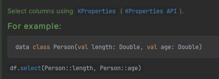

  As you can see, the example generated has the right, clickable function name!
  Of course, we could write the example ourselves if the template doesn't suffice.
- There's a generic explanation for all the ways columns can be selected:

  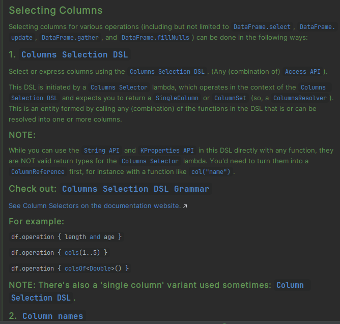

  This is a bit large, so it's best if we just link to it. Also, you'll see the examples have
  the generic `operation` name. So let's create our own interface `SelectSelectingOptions` we can let users link to and
  `{@set [SelectingColumns.OPERATION] [select][select]}`.
  Actually, we can even put this setting the operation arg in a central place, since we reuse it a lot.

  All in all, we get:

  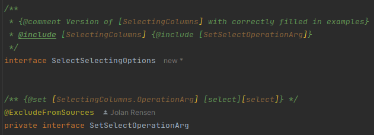

After using these templates (and a tiny bit of tweaking), we get a fully
and [extensively documented operation](core/generated-sources/src/main/kotlin/org/jetbrains/kotlinx/dataframe/api/select.kt) :)

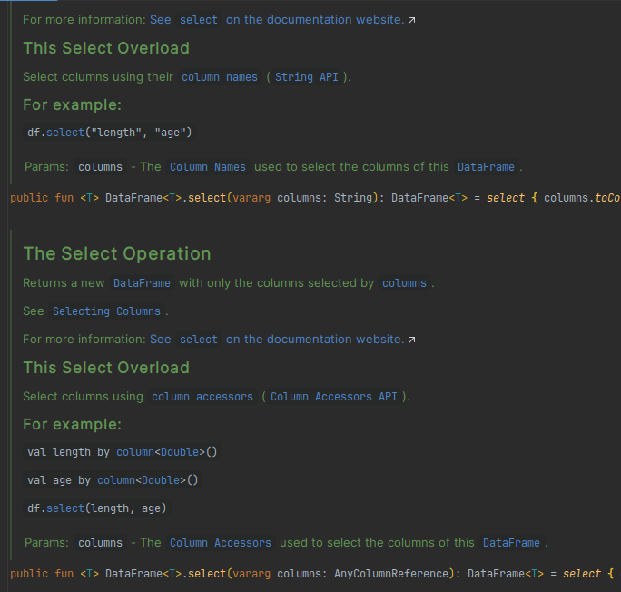

### Clickable Examples

Examples inside ` ```kt ``` ` code blocks are not clickable unfortunately, as they are not resolved
as actual code
([KT-55073](https://youtrack.jetbrains.com/issue/KT-55073/Improve-KDoc-experience),
[KTIJ-23232](https://youtrack.jetbrains.com/issue/KTIJ-23232/KDoc-autocompletion-and-basic-highlighting-of-code-samples)).

To work around this, we can do it manually by adding `` ` `` tags and references to functions.
For instance, writing

```kt 
/**
 * For example:
 *
 * `df.`[`select`][DataFrame.select]`  {  `[`allExcept`][ColumnsSelectionDsl.allExcept]`("a") }`
 */
```

will render it correctly, like:

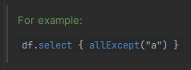

But keep these things in mind:

- `[]` references don't work inside `` ` `` tags, so make sure you write them outside code scope.
- Make sure all empty spaces are inside `` ` `` code spans. If they aren't, they will render weirdly.
- According to the [spec](https://github.github.com/gfm/#code-spans), if a string inside a `` ` `` code span `` ` ``
  begins and ends with a space but does not consist entirely of whitespace, a single space is removed from the front
  and the back. So be careful writing things like `` ` { ` `` and add extra spaces if needed.
- In IntelliJ, references inside `[]` are automatically formatted as `<code>` when rendered to HTML at the moment.
  This may change in the future,
  so if you want to be sure it looks like code, you can write it like: `` [`function`][ref.to.function]  ``
- Having multiple `[]` references and code spans in the same line breaks rendering in
  IntelliJ ([KT-55073](https://youtrack.jetbrains.com/issue/KT-55073/Improve-KDoc-experience#focus=Comments-27-6854785.0-0)).
  This can be avoided by providing aliases to each reference.
- Both `**` and `__` can be used to make something __bold__ in Markdown. So if you ever need to `@include` something
  bold next to something else bold and you want to avoid getting `**a****b**` (which doesn't render correctly),
  alternate,
  like `**a**__b__`.
- Add one extra newline if you want to put something on a new line. Otherwise, they'll render on the same line.
- Use `&nbsp;` (or `{@include [Indent]}`) to add non-breaking-space-based indents in you code samples.

### DSL Grammars

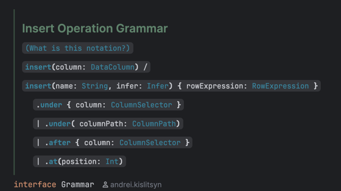

Any family of functions or operations can show off their notation in a DSL grammar.
This is done by creating a documentation interface like
[`Update.Grammar`](./core/src/main/kotlin/org/jetbrains/kotlinx/dataframe/api/update.kt) and linking to it
from each function.

Each grammar doc must come with a `{@include [DslGrammarLink]}`, which is a link to provide the user with the details
of how the [DSL grammar notation](core/src/main/kotlin/org/jetbrains/kotlinx/dataframe/documentation/DslGrammar.kt)
works.
An explanation is provided for each symbol used in the grammar.

I'll copy it here for reference:

The notation we use is _roughly_ based on [EBNF](https://en.wikipedia.org/wiki/Extended_Backus%E2%80%93Naur_form)
with some slight deviations to improve readability in the context of Kotlin.
The grammars are also almost always decorated with highlighted code snippets allowing you to click around and explore!

#### Symbols

- '**`bold text`**' : literal Kotlin notation, e.g. '**`myFunction`**', '**`{ }`**', '**`[ ]`**', etc.
- '`normal text`' : Definitions or types existing either just in the grammar or in the library itself.
- '`:`' : Separates a definition from its type, e.g. '`name: String`'.
- '`|`', '`/`' : Separates multiple possibilities, often clarified with `()` brackets or spaces, e.g. '**`a`**` ( `**`b`
  **` | `**`c`**` )`'.
- '`[ ... ]`' : Indicates that the contents are optional, e.g. '`[ `**`a`**` ]`'. Careful to not confuse this with *
  *bold** Kotlin brackets **`[]`**.
    - NOTE: sometimes **`function`**` [`**`{ }`**`]` notation is used to indicate that the function has an optional
      lambda. This function will still require **`()`** brackets to work without lambda.
- '**`,`**` ..`' : Indicates that the contents can be repeated with multiple arguments of the same type(s), e.g. '`[ `*
  *`a,`**` .. ]`'.
- '`( ... )`' : Indicates grouping, e.g. '`( `**`a`**` | `**`b`**` )` **`c`**'.

No other symbols of [EBNF](https://en.wikipedia.org/wiki/Extended_Backus%E2%80%93Naur_form) are used.

Note that the grammar is not always 100% accurate to keep the readability acceptable.
Always use your common sense reading it, and if you're unsure, try out the function yourself or check
the source code :).

## Advanced DSL Grammar Templating (Columns Selection DSL)

One place where KoDEx really shines is in the templating of DSL grammars.
This has been executed for providing DSL grammars to each function family of the Columns Selection DSL
(and a single large grammar for the DSL itself and the website).
It could be repeated in other places if it makes sense there.
I'll provide a brief overview of how this is structured for this specific case.

The template is defined
at [DslGrammarTemplateColumnsSelectionDsl.DslGrammarTemplate](./core/src/main/kotlin/org/jetbrains/kotlinx/dataframe/documentation/DslGrammarTemplateColumnsSelectionDsl.kt).

Filled in, it looks something like:

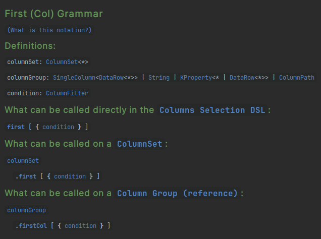

As you can see, it consists of three parts: `Definitions`, `What can be called directly in the Columns Selection DSL`,
`What can be called on a ColumnSet`, and `What can be called on a Column Group (reference)`.

The definition part is filled in like:

```kt 
/**
 * {@set [DslGrammarTemplate.DEFINITIONS]
 *  {@include [DslGrammarTemplate.ColumnSetDef]}
 *  {@include [LineBreak]}
 *  {@include [DslGrammarTemplate.ColumnGroupDef]}
 *  {@include [LineBreak]}
 *  {@include [DslGrammarTemplate.ConditionDef]}
 *  ...
 * }
 */
```

Inside, it should contain all definitions used in the current grammar.
All definitions are defined at `DslGrammarTemplate.XDef` and they contain their formal name and type.
They need to be broken up by line breaks.

All other parts are filled in like:

```kt
/**
 * {@set [DslGrammarTemplate.PLAIN_DSL_FUNCTIONS]
 *  {@include [PlainDslName]}`  [  `**`{ `**{@include [DslGrammarTemplate.ConditionRef]}**` \}`**` ]`
 *  ...
 * }
 *
 * {@set [DslGrammarTemplate.COLUMN_SET_FUNCTIONS]
 *  {@include [Indent]}{@include [ColumnSetName]}`  [  `**`{ `**{@include [DslGrammarTemplate.ConditionRef]}**` \}`**` ]`
 *  ...
 * }
 * ...
 */
interface Grammar {

    /** [**`first`**][ColumnsSelectionDsl.first] */
    interface PlainDslName

    /** __`.`__[**`first`**][ColumnsSelectionDsl.first] */
    interface ColumnSetName

    /** __`.`__[**`firstCol`**][ColumnsSelectionDsl.firstCol] */
    interface ColumnGroupName
}
```

When a reference to a certain definition is used, we take `DslGrammarTemplate.XRef`.
Clicking on them takes users to the respective
`XDef` and thus provides them with the formal name and type of the definition.

You may also notice that the `PlainDslName`, `ColumnSetName`, and `ColumnGroupName` interfaces are defined separately.
This is to make sure they can be reused in the large Columns Selection DSL grammar and on the website.

You don't always need all three parts in the grammar; not all functions can be used in each context.
For instance, for the function `none()`, the column set- and column group parts can be dropped.
This can be done in this template by overwriting the respective `DslGrammarTemplate.XPart` with nothing, like here:

<p align="center">
  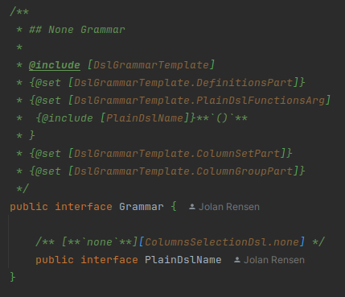
&nbsp; &nbsp; &nbsp; &nbsp;
  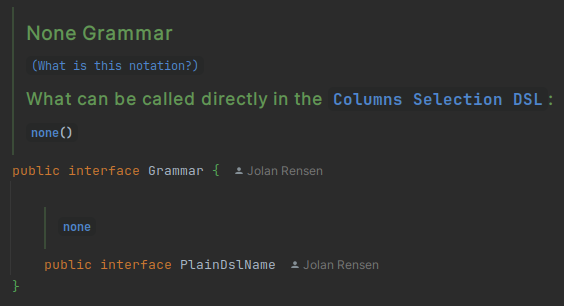
</p>

Finally, to wrap up the part about this specific template, I'd like to show you the end result.
This is a part of the grammar for the `ColumnsSelectionDsl` itself and how it renders in the KDoc on the user side:

<p align="center">
  
&nbsp; &nbsp; &nbsp; &nbsp;
  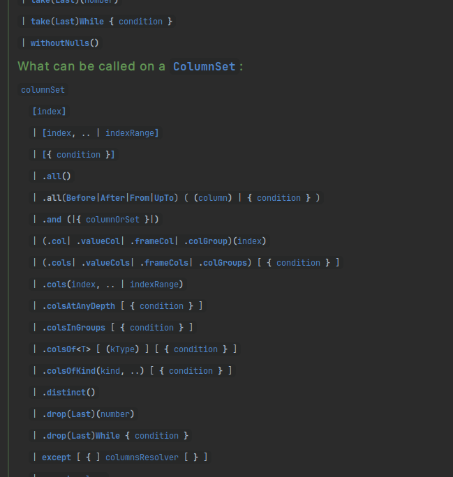
</p>

A fully interactive, single-source-of-truth grammar for the Columns Selection DSL!

## KDoc -> WriterSide

There's a special annotation, `@ExportAsHtml`, that allows you to export the content of the KDoc of the annotated
function, interface, or class as HTML.
The Markdown of the KDoc is rendered to HTML using [JetBrains/markdown](https://github.com/JetBrains/markdown) and, in
the case of DataFrame, put in [./docs/StardustDocs/resources/snippets/kdocs](docs/StardustDocs/resources/snippets/kdocs).
From there, the HTML can be included in any WriterSide page as an iFrame.
This can be done using our custom `<inline-frame src=""/>` tag.

An example of the result can be found in the
[DataFrame documentation](https://kotlin.github.io/dataframe/columnselectors.html#full-dsl-grammar).

The annotation supports two parameters: `theme`, and `stripReferences`, which both are `true` by default.
When the `theme` argument is `true`, some CSS is added to the HTML output to make it look good in combination with
WriterSide. If the `stripReferences` is `true`, all `[]` references are stripped,
like `[name][fully.qualified.name]` -> `<code>name</code>`. This makes the output a lot more readable since
the references won't be clickable in the HTML output anyway.

Optionally, the tags `@exportAsHtmlStart` and `@exportAsHtmlEnd` can be used to mark the start and end of the content
to be exported as HTML.
This is useful when you only want to export a part of the KDoc.

`@ExportAsHtml` can also safely be used in combination with `@ExcludeFromSources`.
