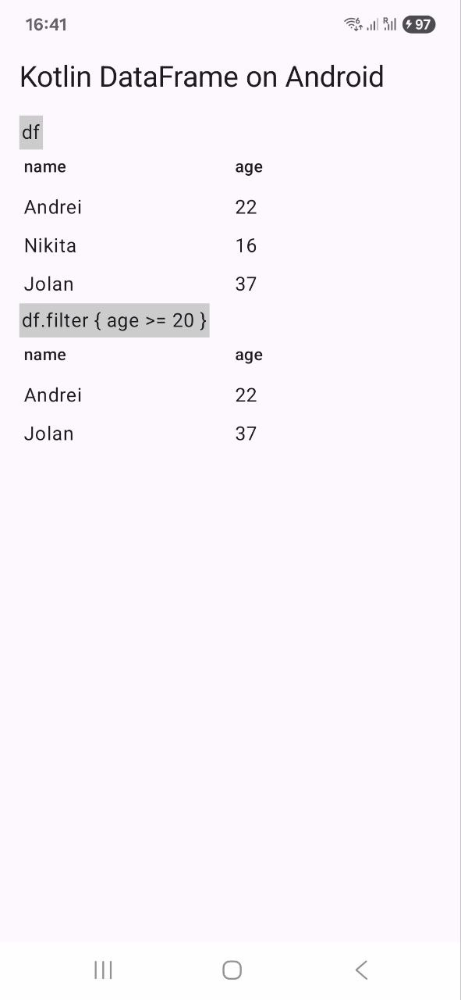

# 📱 Android Example

A minimal Android project showcasing integration with **Kotlin DataFrame**.

  

It also includes the [Kotlin DataFrame Compiler Plugin](https://kotlin.github.io/dataframe/compiler-plugin.html).

> **Note:** The generated [extension properties](https://kotlin.github.io/dataframe/extensionpropertiesapi.html) 
> may not be highlighted correctly in current stable versions of Android Studio due to limited IDE support. 
> However, they work as expected at runtime and during compilation.
