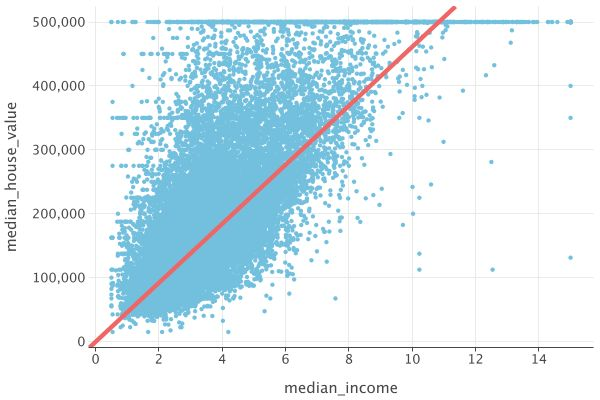

# spark-parquet-dataframe

This example shows how to:
- Load a CSV (California Housing) with local Apache Spark
- Write it to Parquet, then read Parquet back with Kotlin DataFrame (Arrow-based reader)
- Train a simple Linear Regression model with Spark MLlib
- Export the model in two ways and explain why we do both
- Inspect the saved Spark model artifacts
- Build a 2D plot for a single model coefficient

Below is a faithful, step-by-step walkthrough matching the code in `SparkParquetDataframe.kt`.

## The 10 steps of the example (with explanations)

1. Start local Spark
   - A local `SparkSession` is created. The example configures Spark to work against the local filesystem and sets Java options required by Arrow/Parquet.

2. Read `housing.csv` with Spark
   - Spark loads the CSV with header and automatic schema inference into a Spark DataFrame.

3. Show the Spark DataFrame and write it to Parquet
   - `show(10, false)` prints the first rows for inspection.
   - The DataFrame is written to a temporary directory in Parquet format.

4. Read this Parquet with Kotlin DataFrame (Arrow backend)
   - Kotlin DataFrame reads the concrete `part-*.parquet` files produced by Spark using the Arrow-based Parquet reader.

5. Print `head()` of the Kotlin DataFrame
   - A quick glance at the loaded data in Kotlin DataFrame form.

6. Train a regression model with Spark MLlib
   - Numeric features are assembled with `VectorAssembler` (the categorical `ocean_proximity` is excluded).
   - A `LinearRegression` model (no intercept in the code, elasticNet=0.5, maxIter=10) is trained on a train split.

7. Export model summary to Parquet (tabular, portable)
   - The learned coefficients are paired with their feature names, plus a special row for the intercept.
   - This small, explicit summary table is written to Parquet. It’s easy to exchange and read without Spark.

8. Read the model-summary Parquet with Kotlin DataFrame
   - Kotlin DataFrame reads the summary Parquet and prints its head. This is the portable path for analytics/visualization.

9. Save the full fitted PipelineModel and inspect internals
   - The entire fitted `PipelineModel` is saved using Spark’s native ML writer. This produces a directory with both JSON metadata and Parquet data.
   - For exploration, the example then reads some of those JSON and Parquet files back using Kotlin DataFrame.
   - Notes:
     - Internal folder names contain stage indices and UIDs (e.g., `0_...`, `1_...`) and may vary across Spark versions.
     - This inspection method is for exploration only. For reuse in Spark, you should load using `PipelineModel.load(...)`.
   - Sub-steps:
     - 9.1 Root metadata (JSON): read each file under `.../metadata/` and print heads.
     - 9.2 Stage 0 (VectorAssembler): read JSON metadata and Parquet data under `.../stages/0_*/{metadata,data}` if present.
     - 9.3 Stage 1 (LinearRegressionModel): read JSON metadata and Parquet data under `.../stages/1_*/{metadata,data}` if present.

10. Build a 2D plot using one coefficient
   - We choose the feature `median_income` and the label `median_house_value` to produce a 2D scatter plot.
   - From the summary table, we extract the slope for `median_income` and the intercept, and draw the line `y = slope*x + intercept`.
   - Sub-steps:
     - 10.1 Concatenate any metadata JSON frames that were successfully read (optional, for inspection).
     - 10.2 Use the model-summary table (coefficients + intercept) as the unified model data source.
     - 10.3 Compute the slope/intercept for the chosen feature from the summary table.
     - 10.4 Create a Kandy plot (points + abLine) and save it to `linear_model_plot.jpg`.
   - The plot is saved as `linear_model_plot.jpg` (an example image is committed at `lets-plot-images/linear_model_plot.jpg`).



## Why two ways to serialize the model?

We deliberately show both because they serve different goals:
- Tabular summary (Parquet):
  - A small, human- and tool-friendly table of coefficients + intercept.
  - Portable across tools; easy to read directly in Kotlin DataFrame, pandas, SQL engines, etc.
  - Great for analytics, reporting, and plotting.
- Full Spark ML writer (PipelineModel.save):
  - Contains everything needed to reuse the trained model inside Spark (including metadata and internal data).
  - Directory layout and file names aren’t guaranteed to be stable across versions; the intended way to consume is `PipelineModel.load(...)` in Spark.
  - Not ideal as a cross-tool tabular export, but perfect for production use in Spark pipelines.

## Why do we plot only one coefficient?

The linear model has multiple coefficients (one per feature). A 2D chart can only show two axes. To visualize the learned relationship, we pick a single feature (here, `median_income`) and the target (`median_house_value`) and draw the corresponding fitted line. You can repeat the procedure with any other feature to obtain a different 2D projection of the multi-dimensional model.

## About the dataset (`housing.csv`)

1. __longitude:__ How far west a house is; higher values are farther west
2. __latitude:__ How far north a house is; higher values are farther north
3. __housingMedianAge:__ Median age of a house within a block; lower means newer
4. __totalRooms:__ Total number of rooms within a block
5. __totalBedrooms:__ Total number of bedrooms within a block
6. __population:__ Total number of people residing within a block
7. __households:__ Total number of households within a block
8. __medianIncome:__ Median household income (in tens of thousands of USD)
9. __medianHouseValue:__ Median house value (in USD)
10. __oceanProximity:__ Location of the house with respect to the ocean/sea

The CSV file is located at `examples/housing.csv` in the repository root.

## Windows note

<details>
<summary>Running on Windows: install winutils and set Hadoop environment variables</summary>

On Windows, Spark may require Hadoop native helpers. If you see errors like "winutils.exe not found" or permission/FS issues, do the following:

1. Install winutils.exe that matches your Spark/Hadoop version and place it under a Hadoop directory, e.g. `C:\hadoop\bin\winutils.exe`.
2. Set environment variables:
   - `HADOOP_HOME=C:\hadoop`
   - Add `%HADOOP_HOME%\bin` to your `PATH`
3. Restart your IDE/terminal so the variables are picked up and re-run the example.

This ensures Spark can operate correctly with Hadoop on Windows.
</details>


## SparkSession configuration to bypass Hadoop/winutils and enable Arrow

Use the following SparkSession builder if you want to completely avoid native Hadoop libraries (including winutils on Windows) and enable Arrow-related add-opens:

```kotlin
val spark = SparkSession.builder()
    .appName("spark-parquet-dataframe")
    .master("local[*]")
    .config("spark.sql.warehouse.dir", Files.createTempDirectory("spark-warehouse").toString())
    // Completely bypass native Hadoop libraries and winutils
    .config("spark.hadoop.fs.defaultFS", "file:///")
    .config("spark.hadoop.fs.AbstractFileSystem.file.impl", "org.apache.hadoop.fs.local.LocalFs")
    .config("spark.hadoop.fs.file.impl.disable.cache", "true")
    // Disable Hadoop native library requirements and native warnings
    .config("spark.hadoop.hadoop.native.lib", "false")
    .config("spark.hadoop.io.native.lib.available", "false")
    .config(
        "spark.driver.extraJavaOptions",
        "--add-opens=java.base/java.nio=org.apache.arrow.memory.core,ALL-UNNAMED"
    )
    .config(
        "spark.executor.extraJavaOptions",
        "--add-opens=java.base/java.nio=org.apache.arrow.memory.core,ALL-UNNAMED"
    )
    .getOrCreate()
```

Notes:
- This configuration uses the pure-Java local filesystem (file://) and disables Hadoop native library checks, making winutils unnecessary.
- If you rely on HDFS or native Hadoop tooling, omit these overrides and configure Hadoop as usual.

## What each Spark config does (and why it matters on JDK 21 and the Java module system)
- `spark.sql.warehouse.dir=Files.createTempDirectory("spark-warehouse").toString()`
  - Points Spark SQL’s warehouse to an ephemeral, writable temp directory.
  - Avoids permission issues and clutter in the project directory, especially on Windows.
- `spark.hadoop.fs.defaultFS = file:///`
  - Forces Hadoop to use the local filesystem instead of HDFS.
  - Bypasses native Hadoop bits and makes winutils unnecessary on Windows for this example.
- `spark.hadoop.fs.AbstractFileSystem.file.impl = org.apache.hadoop.fs.local.LocalFs`
  - Ensures the AbstractFileSystem implementation resolves to the pure-Java LocalFs.
- `spark.hadoop.fs.file.impl.disable.cache = true`
  - Disables FS implementation caching so the LocalFs overrides are applied immediately within the current JVM.
- `spark.hadoop.hadoop.native.lib = false` and `spark.hadoop.io.native.lib.available = false`
  - Tell Hadoop not to load native libraries and suppress related warnings.
  - Prevents errors stemming from missing native binaries (e.g., winutils) when you only need local file IO.
- `spark.driver.extraJavaOptions` and `spark.executor.extraJavaOptions` with:
  `--add-opens=java.base/java.nio=org.apache.arrow.memory.core,ALL-UNNAMED`
  - Why needed: Starting with the Java Platform Module System (JDK 9+) and especially under JDK 17/21 (JEP 403 strong encapsulation), reflective access into JDK internals is restricted. Apache Arrow (used by the vectorized Parquet reader in Kotlin DataFrame) may need reflective access within java.nio for memory management and buffer internals. Without opening the package, you can get errors like:
    - `java.lang.reflect.InaccessibleObjectException: module java.base does not open java.nio to org.apache.arrow.memory.core`
    - ...does not open `java.nio` to unnamed module @xxxx
  - What it does: Opens the `java.nio` package in module `java.base` at runtime to both the named module org.apache.arrow.memory.core (when Arrow is on the module path) and to ALL-UNNAMED (when Arrow is on the classpath). This enables Arrow’s memory code to work on modern JDKs.
  - Driver vs executor: In `local[*]` both apply to the same process, but keeping both symmetric makes this snippet cluster-ready (executors are separate JVMs).
  - When you might not need it: On JDK 8 (no module system) or if your stack does not use Arrow’s vectorized path. On JDK 17/21+, keep it if you see `InaccessibleObjectException` referencing `java.nio`.
  - Other packages: Some environments/libraries (e.g., Netty) may require additional opens such as `--add-opens=java.base/sun.nio.ch=ALL-UNNAMED`. Only add the opens that your error messages explicitly mention.
  - Security note: add-opens affects only the current JVM process at runtime; it doesn’t change compile-time checks or system-wide settings.

## Troubleshooting on JDK 17+
- Symptom: `InaccessibleObjectException` mentioning java.nio or “illegal reflective access” warnings.
  - Fix: Ensure both spark.driver.extraJavaOptions and `spark.executor.extraJavaOptions` include the exact `--add-opens` string shown above.
- Symptom: Works in IDE, fails with spark-submit.
  - Fix: Pass the options with `--conf spark.driver.extraJavaOptions=...` and `--conf spark.executor.extraJavaOptions=...` (or via SPARK_SUBMIT_OPTS), not only in IDE settings.
- Symptom: On Windows, “winutils.exe not found”.
  - Fix: Either use this configuration block (bypassing native Hadoop) or install winutils as described in the Windows note above.
